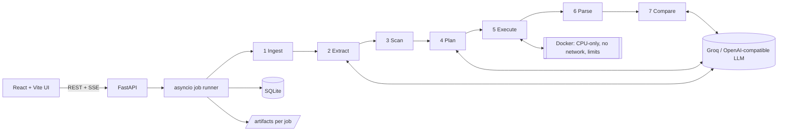

# ReproScope

ReproScope checks whether the results reported in a machine-learning paper can be reproduced from the authors'
published code. Upload the paper PDF and the repository; ReproScope extracts the reported claims, scans the repo,
runs the experiments in an isolated CPU-only Docker container, compares the numbers, and explains discrepancies
with evidence from the paper, the code and the logs.

> **The LLM proposes; deterministic code verifies.** Every quote is checked against the PDF text, every command
> against the files and CLI flags that exist, every obtained number against an output file or log line.
> Nothing is fabricated: stages that are not built yet are reported as *not implemented*.

## Status

| Phase | Scope | State |
|---|---|---|
| 1. Foundation | Uploads + validation, jobs, SQLite models, SSE progress, replay, report UI, Markdown/JSON export | **Done** |
| 2. End-to-end reproducibility | Claim extraction + grounding, repo scan, run planning + validation, Docker execution, metric parsing, comparison | **Done** |
| 3. Evidence & reporting | 12 deterministic discrepancy rules, claim verdicts with stated tolerances, report builder, exports, job history | **Done** |
| 4. Standout features | Repeat runs for unseeded scripts, automatic + user-approved hypothesis reruns, evidence-constrained LLM explanations, scorecard, replay, PDF viewer with highlighted quotes, repository file viewer | **Done** |

Every job now runs all seven stages for real: Groq (or another OpenAI-compatible model) extracts and plans,
deterministic code verifies, experiments run in an isolated CPU-only Docker container, and the report links
every number to its evidence. The **Sample report** page still shows the labelled fixture
(`backend/reproscope/fixtures/sample_report.json`, `is_fixture: true`) for UI reference.

### How verdicts are decided

| Verdict | Rule |
|---|---|
| REPRODUCED | \|obtained − reported\| ≤ tolerance |
| PARTIAL | ≤ 3 × tolerance |
| NOT_REPRODUCED | beyond 3 × tolerance (a result *better* than reported is flagged, never rewarded) |
| INCONCLUSIVE | the run was cut short (timeout / reduced budget) |
| NOT_RUN / NO_METRIC / UNVERIFIED_CLAIM | could not execute · ran but reported no value · claim not found in the PDF |

Tolerance: 2 × the paper's std when given; else 1 percentage point for accuracy-like metrics, 3 % otherwise;
for scripts without a fixed seed the command is run 3 times, the mean is compared and the tolerance is
widened to 2 × the measured std.

## Architecture



- **Backend** (`backend/reproscope`): `main.py` (API), `jobs.py` (pipeline runner), `events.py` (persisted event
  bus → SSE, replay), `db.py` (SQLModel tables), `schemas.py` (API contracts), `storage.py` (artifact layout),
  `stages/` (one module per stage), `report.py` + `templates/` (Markdown export).
- **Frontend** (`frontend/src`): `pages/NewAnalysis`, `pages/Pipeline` (live + replay), `pages/ReportPage`,
  `components/report/*` (summary, Recharts gap chart, claims/evidence, findings, runs, explanations).
  `types.ts` mirrors `schemas.py`.
- **Artifacts**: `backend/data/artifacts/{job_id}/` holds `paper.pdf`, `pages.json`, `repo/`, and
  `stages/NN_<stage>.json`; experiment runs will work on per-run copies, never the pristine repo.

## Setup

Requirements: Python 3.11, Node 20+, Git, Docker Desktop (needed from Phase 2 for experiment execution).

```bash
# backend
cd backend
py -3.11 -m venv .venv            # macOS/Linux: python3.11 -m venv .venv
.venv\Scripts\python -m pip install -r requirements.txt
copy ..\.env.example .env         # then paste your GROQ_API_KEY (free at console.groq.com)
.venv\Scripts\python -m uvicorn reproscope.main:app --port 8000
```

```bash
# frontend (second terminal)
cd frontend
npm install
npm run dev                        # http://localhost:5173, proxies /api to :8000
```

**Windows path-length note:** if the project lives in a deeply nested folder, `pip` and Python imports can hit the
260-character limit. Keep the checkout path short (e.g. `C:\Users\<you>\ReproScope`), or create the virtualenv
elsewhere (`py -3.11 -m venv %LOCALAPPDATA%\reproscope\venv`) and set `REPROSCOPE_DATA_DIR` to a short path.

## Usage

1. Open http://localhost:5173 and choose the paper PDF and a GitHub/GitLab/Bitbucket URL or a ZIP.
2. **Start analysis** opens the live pipeline view (stages, progress, event log streamed over SSE).
3. Finished jobs can be **replayed** from history (`/jobs/<id>?replay=1`): stored events are re-streamed with
   scaled timing; nothing is executed.
4. **Sample report** shows the report layout on the labelled fixture, including Markdown/JSON export.

## Demo

The repository ships a deterministic practice case: a **synthetic** 3-page paper (every page says so) and
`backend/tests/fixtures/planted_repo`, a real scikit-learn project with six deliberately planted
discrepancies (answer key: `backend/tests/fixtures/planted_truth.json`).

```bash
cd backend
.venv\Scripts\python scripts\make_demo.py --submit   # builds demo/ and starts an analysis
```

**Live mode** runs everything for real (LLM extraction/planning, Docker experiments; about 1–2 minutes after the
first image build). Expected outcome: logistic-regression and MLP accuracy claims reproduce within tolerance,
the logistic-regression Macro-F1 claim reports **NO_METRIC** (the script never computes it), and the findings
include the learning-rate mismatch (`train.py:21`), the 80/20 vs `test_size=0.3` split, the missing seed with
measured run-to-run spread, `average="micro"` vs macro-F1, unpinned dependencies and the GPU-only script.
Exact numbers vary between runs because the planted `train.py` sets no seed — that is the point.

**Replay mode**: open any finished analysis from the history and choose **Replay**; stored events are
re-streamed and nothing is executed. Use this as the fallback during a live demo.

**Inspect evidence** in a report: *View in the paper* opens the PDF at the cited page with the quote
highlighted; any `file:line` opens the repository file at that line; *Test a hypothesis* reruns a claim's
command with values you choose (validated against the script's real flags).

## API

| Method | Path | Purpose |
|---|---|---|
| GET | `/api/health` | LLM mode (live/dev), Docker availability, limits |
| POST | `/api/llm/check` | one tiny live LLM call to verify key, model and structured output |
| POST | `/api/jobs` | multipart `pdf` + (`repo_url` \| `repo_zip`) + optional JSON `options` |
| GET | `/api/jobs`, `/api/jobs/{id}` | job list / status with per-stage state |
| GET | `/api/jobs/{id}/events` | SSE stream (resumes with `Last-Event-ID`; `?replay=true&speed=N`) |
| GET | `/api/jobs/{id}/events/history` | stored events as JSON |
| POST | `/api/jobs/{id}/replay` | replay URL for a finished job |
| GET | `/api/jobs/{id}/stages/{stage}` | structured output of one stage |
| GET | `/api/jobs/{id}/pdf` | the uploaded paper |
| GET | `/api/jobs/{id}/file?path=` | a repository text file (read-only, path-checked) |
| POST | `/api/jobs/{id}/rerun` | user-approved hypothesis rerun: `{claim_id, overrides: {flag: value}, note?}` (≤ 3 overrides) |
| GET | `/api/jobs/{id}/reruns` | rerun status and results |
| GET | `/api/jobs/{id}/logs` | every experiment run with status and log URL |
| GET | `/api/jobs/{id}/runs/{run_id}/log` | full stdout/stderr of one run |
| GET | `/api/jobs/{id}/report`, `/export?format=markdown\|json` | full report / download (409 until the job is done) |
| GET | `/api/fixtures/sample-report`, `/export` | labelled fixture report and its exports |

Interactive docs: http://localhost:8000/docs

## Tests

```bash
cd backend
.venv\Scripts\python -m pytest -q
```

Covers PDF validation and page extraction, git URL rules, ZIP path-traversal and symlink rejection, job creation
and persistence, stage status reporting, the SSE stream (backlog, resume, terminal event), replay, the event-bus
sequence, fixture validity and labelling, and the Markdown/JSON exports.

## Security notes

- Uploads are size-limited and type-checked; ZIPs are extracted with path-traversal, symlink, entry-count and
  unpacked-size checks; git clones are shallow, https-only, host-allow-listed, credential-free and time-limited.
- Repository code is never executed by the backend process. From Phase 2 it runs only inside throwaway Docker
  containers: non-root, no network during the run, CPU/memory caps, timeout, and a per-run copy of the repo.

## Limitations

- PDFs need a text layer (no OCR).
- Planned scope is Python repositories (scikit-learn / PyTorch) with CPU-sized experiments.
