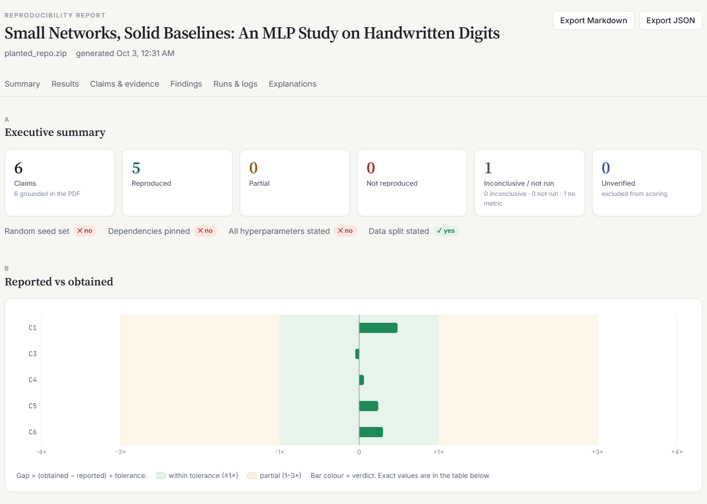
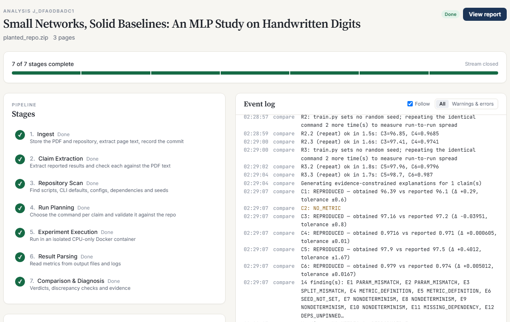
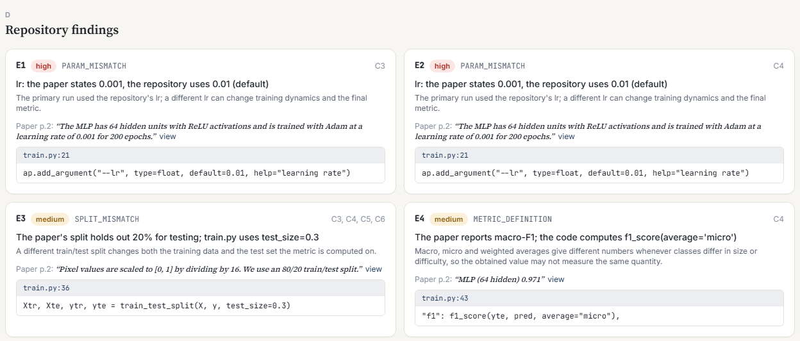
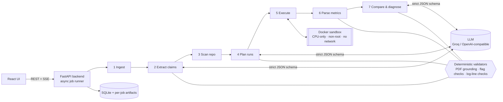

# ReproScope

**Does this ML paper reproduce?** ReproScope takes a machine-learning paper (PDF) and its published code,
runs the authors' own experiments in an isolated CPU-only sandbox, and returns a claim-by-claim
reproducibility report in which every number links to its evidence: the page of the paper, the line of
code, or the line of the run log.

> **The LLM proposes. Deterministic code verifies.** A language model reads the paper and suggests which
> command reproduces each result, but nothing counts until code has checked it: every quote must exist in
> the PDF, every command must use scripts and flags that exist in the repository, and every measured
> number must come from an output file or a log line that really exists.



---

## Contents

- [Why](#why)
- [What it does](#what-it-does)
- [How it works](#how-it-works)
- [What it catches](#what-it-catches)
- [How verdicts are decided](#how-verdicts-are-decided)
- [Quick start](#quick-start)
- [Try the demo](#try-the-demo)
- [Configuration](#configuration)
- [Security model](#security-model)
- [API](#api)
- [Project structure](#project-structure)
- [Tests](#tests)
- [Limitations](#limitations)
- [References](#references)

## Why

A paper reports 97.2%. You run the authors' code and get something else. Usually the cause is not in the
paper at all: a default learning rate that differs from the one the paper states, a different train/test
split, a metric computed with a different averaging, a missing random seed. Finding that out by hand means
cloning, installing, running and diffing, which takes hours. LLM summarisers read the paper but never run
the code.

ReproScope automates that investigation and shows its work.

## What it does

- **Extracts every quantitative claim** from the paper (metric, value, ± std, dataset, split, stated
  hyperparameters) and **grounds** each one: the quote and the exact number must be found in the PDF text.
  Claims that fail are shown as *unverified* and never scored. Wrong page citations are corrected.
- **Scans the repository without running it**: entry points, CLI arguments and their defaults, YAML / JSON /
  TOML configs, dependencies and pins, random-seed calls (per script, via the import graph), data splits,
  metric calls, checkpoints and GPU-only code — each with `file:line`.
- **Plans one command per claim.** Candidate commands are built by code from the README, script defaults and
  config files; the LLM may only choose among them. Flags are validated against the script's real argparse
  definition, and the paper's hyperparameters are never slipped into the primary run.
- **Executes in Docker**: CPU-only, non-root, no network, CPU / memory / process / time limits, with live logs.
  Scripts without a fixed seed are run three times so run-to-run spread is *measured*, not assumed.
- **Parses metrics** from output files first, then log lines, then an LLM fallback that is accepted only if
  the line it quotes exists verbatim in the log and contains the value.
- **Decides a verdict** for every claim with a stated tolerance, runs **12 deterministic discrepancy checks**,
  and can **test explanations**: rerun the command with one value changed (e.g. the paper's learning rate) and
  report whether that *supports* the explanation — never that it proves it.
- **Reports with evidence**: highlighted quote in the PDF viewer, repository file viewer at the cited line,
  full run logs, Markdown and JSON export, live progress over Server-Sent Events, and replay of any finished
  analysis without re-running anything.

| Live pipeline | Evidence-backed findings |
|---|---|
|  |  |

## How it works



| Stage | What happens | LLM? |
|---|---|---|
| 1 Ingest | Validate PDF + repo (Git URL or ZIP), extract page text, record the commit hash | no |
| 2 Extract claims | Schema-locked extraction, then quote and number grounding against the PDF text | proposes |
| 3 Scan repo | AST + config parsing: arguments, defaults, configs, deps, seeds, imports, splits, metrics | no |
| 4 Plan runs | Code builds candidate commands; the LLM picks one per claim; every flag and value is validated | chooses |
| 5 Execute | Cached environment image per dependency set, fresh locked-down container per run | no |
| 6 Parse metrics | Output files → log patterns → LLM fallback with verbatim line check | fallback only |
| 7 Compare & diagnose | Repeat runs, verdicts, 12 rules, hypothesis reruns, evidence-constrained explanations | explains |

Every stage writes structured JSON and events, so a finished analysis can be reopened or replayed exactly.

## What it catches

| Rule | Example of what it reports (with evidence) |
|---|---|
| `PARAM_MISMATCH` | Paper states `lr = 0.001`; `train.py:21` defaults to `0.01` |
| `PARAM_UNSTATED` | `configs/mlp128.yaml:4` sets `epochs: 200`; the paper never states it for that experiment |
| `SPLIT_MISMATCH` | Paper: 80/20 split; `train.py:36`: `test_size=0.3` |
| `METRIC_DEFINITION` | Paper reports macro-F1; `train.py:43` computes `average="micro"` |
| `SEED_NOT_SET` | No random seed reachable from `train.py` (checked per entry point) |
| `NONDETERMINISM` | Three identical runs gave 97.22, 96.85 and 97.41 |
| `DEPS_UNPINNED` | `scikit-learn` has no version pin |
| `MISSING_DEPENDENCY` | `train_gpu.py:3` imports `torch`, which no dependency file lists |
| `MISSING_ARTEFACT` | A checkpoint the code loads is not in the repository |
| `EVAL_LEAKAGE` | Possible use of test data during training or model selection (flagged for review) |
| `GPU_ONLY` | `.cuda()` with no CPU fallback: reported as not runnable, never faked |
| `REDUCED_BUDGET` | The run hit its time limit, so no definitive failure verdict is given |

## How verdicts are decided

| Verdict | Meaning |
|---|---|
| `REPRODUCED` | \|obtained − reported\| ≤ tolerance |
| `PARTIAL` | within 3 × tolerance |
| `NOT_REPRODUCED` | beyond 3 × tolerance |
| `INCONCLUSIVE` | the run was cut short (timeout or reduced budget) |
| `NOT_RUN` | could not be executed (e.g. GPU-only code), with the reason |
| `NO_METRIC` | the run finished but never reported this metric |
| `UNVERIFIED_CLAIM` | the claim could not be found in the PDF text; excluded from scoring |

**Tolerance:** 2 × the standard deviation the paper reports, if it reports one; otherwise 1 percentage point
for accuracy-like metrics and 3 % of the value for others. For scripts without a fixed seed the command runs
three times, the **mean** is compared, and the tolerance widens to 2 × the measured standard deviation.
A result that is *better* than reported beyond tolerance is flagged for review, never counted as reproduced.

## Quick start

**Requirements:** Python 3.11, Node.js 20.19+ (or 22.12+), Git, and Docker (Docker Desktop on Windows /
macOS). An LLM key is optional: without one, ReproScope runs in a clearly labelled *dev mode* whose LLM
steps are deterministic heuristics, never presented as real analysis.

```bash
git clone https://github.com/Saakar22/reproscope.git
cd reproscope
```

**Backend** (macOS / Linux):

```bash
cd backend
python3.11 -m venv .venv
.venv/bin/pip install -r requirements.txt
cp ../.env.example .env            # then add GROQ_API_KEY (free at https://console.groq.com)
.venv/bin/uvicorn reproscope.main:app --port 8000
```

**Backend** (Windows):

```bash
cd backend
py -3.11 -m venv .venv
.venv\Scripts\pip install -r requirements.txt
copy ..\.env.example .env
.venv\Scripts\uvicorn reproscope.main:app --port 8000
```

**Frontend** (second terminal):

```bash
cd frontend
npm install
npm run dev
```

Open **http://localhost:5173**, upload a paper PDF, give a GitHub / GitLab / Bitbucket URL or a ZIP of the
repository, and press **Start analysis**. The header shows whether the LLM is live and whether Docker is
ready. The first analysis of a repository builds its environment image (about a minute for a small
scikit-learn project, longer with PyTorch); later runs reuse it.

> On Windows, keep the checkout path short (for example `C:\dev\reproscope`): deeply nested paths can hit the
> 260-character limit during `pip install`.

## Try the demo

The repository ships a deterministic practice case: a **synthetic** three-page paper (every page says so)
and [`backend/tests/fixtures/planted_repo`](backend/tests/fixtures/planted_repo), a small real scikit-learn
project with **six deliberately planted discrepancies** and an answer key
([`planted_truth.json`](backend/tests/fixtures/planted_truth.json)).

With both servers running:

```bash
cd backend
.venv/bin/python scripts/make_demo.py --submit      # Windows: .venv\Scripts\python scripts\make_demo.py --submit
```

A live run of this demo produced:

| Claim | Reported | Measured | Verdict |
|---|---|---|---|
| Logistic regression, accuracy | 96.1 ± 0.3 | 96.39 | REPRODUCED (tolerance ±0.6) |
| Logistic regression, macro-F1 | 0.960 | — | NO_METRIC (the script never computes it) |
| MLP-64, accuracy | 97.2 ± 0.4 | 97.16 (mean of 3 runs) | REPRODUCED |
| MLP-64, macro-F1 | 0.971 | 0.9716 | REPRODUCED |
| MLP-128, accuracy | 97.5 ± 0.3 | 97.90 (mean of 3 runs) | REPRODUCED (tolerance widened to ±1.67 by measured spread) |
| MLP-128, macro-F1 | 0.974 | 0.979 | REPRODUCED |

All six planted discrepancies were detected, plus an undeclared `torch` import. Numbers vary slightly
between runs because the planted `train.py` sets no seed — which is exactly what the tool measures.

Any finished analysis can be **replayed** from the history page: stored events are re-streamed and nothing
is executed. The **Sample report** page shows a labelled fixture of the report layout.

## Configuration

Settings are read from environment variables or `backend/.env` (see [`.env.example`](.env.example)).

| Variable | Default | Purpose |
|---|---|---|
| `LLM_PROVIDER` | `groq` | `groq` or `openai_compatible` |
| `GROQ_API_KEY` / `LLM_API_KEY` | — | API key; without it the app runs in labelled dev mode |
| `LLM_MODEL` | `openai/gpt-oss-120b` | Model id |
| `LLM_BASE_URL` | Groq's OpenAI-compatible endpoint | Any OpenAI-compatible `/chat/completions` API |
| `LLM_STRICT_JSON` | `true` | Strict JSON-schema decoding; set `false` for models that only support JSON mode |
| `REPROSCOPE_DATA_DIR` | `backend/data` | SQLite database and per-job artifacts |
| `REPROSCOPE_MAX_PDF_MB` / `..._MAX_ZIP_MB` | `30` / `100` | Upload limits |
| `REPROSCOPE_ALLOWED_GIT_HOSTS` | `github.com,gitlab.com,bitbucket.org` | Hosts repositories may be cloned from |
| `SANDBOX_CPUS` / `SANDBOX_MEMORY` | `2` / `4g` | Per-container limits |
| `SANDBOX_TIMEOUT_S` | `600` | Default per-run time limit (also adjustable per analysis) |

LLM responses are cached on disk by request hash, so replays and repeated analyses do not spend API quota.
The API key is never logged or written to the cache.

## Security model

Uploaded repositories are treated as **untrusted code**.

| Concern | Mitigation |
|---|---|
| Malicious archives | ZIP path-traversal, symlink, entry-count and unpacked-size checks |
| Arbitrary clones | https only, host allow-list, no credentials, shallow clone, time limit |
| Code execution | Never in the backend process; only in throwaway Docker containers |
| Container privileges | Non-root user, all Linux capabilities dropped, `no-new-privileges` |
| Network | Disabled during runs; only the environment build uses the network (`pip install`) |
| Host files | Never mounted: the repository is copied in and outputs copied out, with path, symlink and size checks |
| Resource abuse | CPU, memory, process-count and wall-clock limits per run |
| Shell injection | Commands run as argument lists, never through a shell; values are validated |
| Hallucinated evidence | Quotes, flags and metric lines are verified by code before they count |

These properties are covered by tests that run real containers (non-root, network blocked, writes outside
`/work` denied, no host mounts, timeouts enforced, shell syntax passed literally).

## API

Interactive documentation is served at http://localhost:8000/docs.

| Method | Path | Purpose |
|---|---|---|
| `GET` | `/api/health` | LLM mode, Docker availability, limits |
| `POST` | `/api/llm/check` | One tiny live call to verify the key and model |
| `POST` | `/api/jobs` | Start an analysis: multipart `pdf` + `repo_url` or `repo_zip` (+ optional JSON `options`) |
| `GET` | `/api/jobs`, `/api/jobs/{id}` | Job history and status |
| `GET` | `/api/jobs/{id}/events` | Live progress (SSE); `?replay=true&speed=N` replays a finished job |
| `GET` | `/api/jobs/{id}/stages/{stage}` | Structured output of one stage |
| `GET` | `/api/jobs/{id}/report` | Full report (JSON) |
| `GET` | `/api/jobs/{id}/export?format=markdown\|json` | Download the report |
| `GET` | `/api/jobs/{id}/pdf` | The uploaded paper |
| `GET` | `/api/jobs/{id}/file?path=` | A repository file (read-only, path-checked) |
| `GET` | `/api/jobs/{id}/logs`, `/runs/{run_id}/log` | Experiment runs and their full logs |
| `POST` | `/api/jobs/{id}/rerun` | User-approved hypothesis rerun: `{claim_id, overrides: {flag: value}}` (≤ 3 overrides) |
| `GET` | `/api/jobs/{id}/reruns` | Rerun status and results |

## Project structure

```
backend/
  reproscope/
    main.py            FastAPI app and routes
    jobs.py            pipeline runner
    events.py          persisted event bus (SSE + replay)
    stages/            ingest, extract, scan, plan, execute, parse, compare
    grounding.py       quote + number verification against the PDF
    params.py          parameter matching and effective repo values
    sandbox.py         Docker environment build and locked-down execution
    rules.py           the 12 discrepancy checks
    verdicts.py        tolerances, verdicts, hypothesis outcomes
    diagnose.py        evidence-constrained explanations
    reruns.py          user-approved hypothesis reruns
    report.py          report builder + Markdown export
  scripts/make_demo.py demo paper + repository builder
  tests/               196 tests, planted practice repository and answer key
frontend/
  src/pages/           New analysis, Live pipeline, Report
  src/components/      report sections, PDF viewer, code viewer, rerun panel
demo/                  generated demo paper and repository ZIP
docs/images/           screenshots used in this README
```

## Tests

```bash
cd backend
.venv/bin/python -m pytest -q          # Windows: .venv\Scripts\python -m pytest -q
```

196 tests cover input validation, PDF grounding, the repository scanner (checked against the planted answer
key), plan validation and unsafe-command rejection, metric parsing and unit normalisation, tolerances and
verdicts, every discrepancy rule, the LLM layer (with a mock transport), the API and SSE stream, persistence,
replay, and real Docker execution including the isolation guarantees. Docker-dependent tests are skipped
automatically when Docker is not running.

## Limitations

- **CPU-scale experiments only.** GPU-only code is reported as not runnable; long training runs hit the time
  limit and are marked inconclusive.
- **Python repositories** using argparse / click and YAML / JSON / TOML configs. Notebooks are detected but not
  executed; frameworks such as Hydra are not resolved.
- **PDFs need a text layer** (no OCR), and numbers that appear only inside figures are not extracted.
- **Discrepancy rules are heuristics**: they report evidence for a human to judge, not proof.
- **Environment drift**: exact package versions are recorded, but the original authors' environment cannot
  always be recreated.
- Built as a single-machine application (SQLite, in-process job runner). Scaling out would add a job queue,
  worker pool and shared storage.

## References

1. M. Baker. *1,500 scientists lift the lid on reproducibility.* Nature 533, 452–454, 2016.
2. O. E. Gundersen, S. Kjensmo. *State of the art: Reproducibility in artificial intelligence.* AAAI, 2018.
3. E. Raff. *A step toward quantifying independently reproducible machine learning research.* NeurIPS, 2019.
4. J. Pineau et al. *Improving reproducibility in machine learning research.* JMLR 22, 2021.
5. M. Hutson. *Artificial intelligence faces reproducibility crisis.* Science 359, 725–726, 2018.

---

Built by team **IShowCode** for ELEVATE 1.0 (problem statement EL-01: AI-Powered ML Paper Reproducibility
Platform).
